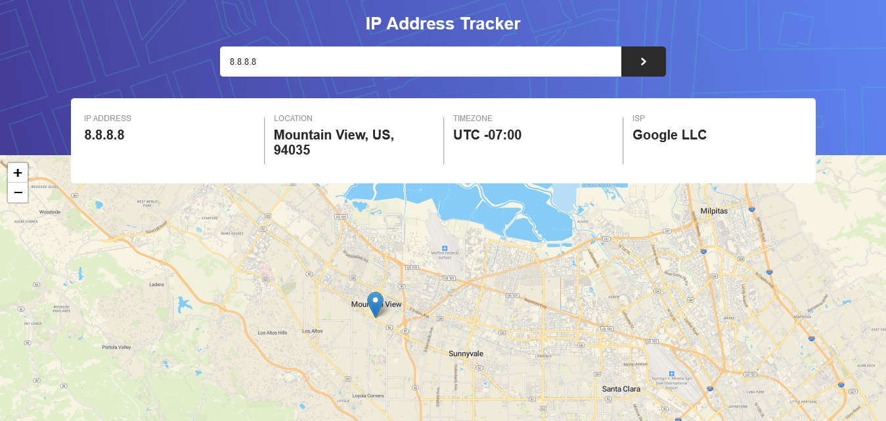

# Frontend Mentor - IP address tracker

This is my repository to the [IP address tracker challenge on Frontend Mentor](https://www.frontendmentor.io/challenges/ip-address-tracker-I8-0yYAH0). Frontend Mentor challenges help you improve your coding skills by building realistic projects. 

## Overview

### The challenge

Users should be able to:

- View the optimal layout for each page depending on their device's screen size
- See hover states for all interactive elements on the page
- See their own IP address on the map on the initial page load
- Search for any IP addresses or domains and see the key information and location

### Screenshot

### Links

- Solution URL: [Github repository](https://github.com/Romario-Negreiros/Ip-address-tracker.git)
- Live Site URL: [Github pages](https://romario-negreiros.github.io/Ip-address-tracker/)

## My Process

### Built with

- Semantic HTML5 markup
- SASS
- Flexbox
- Leaflet JS: [Javascript Library](https://leafletjs.com/index.html)
- Ipify: [Geolocation API](https://geo.ipify.org/docs)
- Jquery: [Javascript library](https://jquery.com)
- Mobile first workflow

## Author

- Website - [Romario Negreiros](https://romario-negreiros.github.io/Romario-frontend/)
- Frontend Mentor - [@Romario-Negreiros](https://www.frontendmentor.io/profile/Romario-Negreiros)
- Github profile - [Romario-Negreiros](https://github.com/Romario-Negreiros)